<p align="center">
  
</p>

<p align="center">
  
  
  
  
  
</p>

# Origin Trace

**Origin Trace** detects, explains, and removes hidden Unicode signatures from text, and reports a set of heuristic statistical structure signals as a secondary, exploratory signal. It's built for teams that need to audit submitted or published text — content integrity, editorial, compliance, security — for invisible payloads before that text moves downstream.

The name is literal: the tool traces a document back through the marks left on it, so you can see exactly what's there before deciding what to do about it.

---

## What it actually does

Origin Trace is two tools in one, and it's deliberately honest about the difference between them:

| Capability | Nature | Reliability |
|---|---|---|
| **Hidden Unicode detection & removal** | Exact codepoint matching against known steganography/spoofing character families | Deterministic — either the character is there or it isn't |
| **Statistical structure scoring** | Heuristic stylometry (lexical diversity, entropy, sentence rhythm, repetition) | Exploratory signal only — see [Limitations](#limitations) |

### 1. Hidden Unicode detection

Scans every character in the input and flags six documented families of invisible/non-printable Unicode use — four steganographic/spoofing vectors, plus two "visually blank" families that a Cc/Cf-only scan would miss:

- **Zero-width & invisible-format characters** — `ZWSP`, `ZWJ`, `ZWNJ`, word joiner, and related invisible-format codepoints. The classic one-bit-per-character watermark carrier.
- **Bidirectional control characters** — `RLO`/`LRO`/`PDF`/embeddings/isolates, used for visual text spoofing (e.g. disguising a file extension).
- **Variation selectors** — the standard set (`VS1-16`) plus the 240-codepoint supplement block, which has a documented use for smuggling arbitrary bytes attached to a visible character.
- **Unicode Tag characters** (`U+E0000`–`U+E007F`) — deprecated for their original language-tagging purpose and now the most common vector for hiding entire ASCII strings behind a single visible glyph.
- **Non-standard Unicode spaces** (category `Zs` beyond the ordinary space) — non-breaking space, thin space, ideographic space, and similar. These render as blank gaps and are extremely common from copy-pasted web/word-processor content; they're not steganographic in intent, but they're just as invisible to the eye.
- **Blank glyphs outside any whitespace/format category** — Hangul Filler, Braille Pattern Blank — characters Unicode classifies as ordinary letters or symbols but which render as nothing, a known trick for producing "empty" usernames or form fields.

Every finding reports its exact position, formal Unicode name, codepoint, category, and surrounding context — an audit trail, not just a count.

### 2. Purification

Strips any combination of the above categories and optionally applies Unicode normalization (`NFC`/`NFKC`) afterward. `strip_unicode_spaces` is a separate toggle from `strip_hidden_unicode` — non-breaking spaces and similar are sometimes intentional typography, so they're on by default but easy to exclude. NFKC also folds many compatibility/homoglyph variants, which is useful when the goal is a canonical, safe-to-store version of the text. The pipeline is entirely in-memory — nothing is written to disk, cached, or logged.

### 3. Statistical structure signals

Four independent stylometric measurements — lexical diversity, character-level entropy, sentence-length variance, and phrase repetition — combined into a single composite score with a confidence band that widens as the sample gets longer.

### 4. File-format input

Hidden Unicode signatures don't only travel in plain text — they ride along inside `.docx` XML runs, `.html` markup, and `.pdf` text layers just as easily. `POST /api/v1/extract` accepts a file upload and returns exact text content, ready to feed into `/analyze` or `/purify`:

| Format | How it's read | Fidelity |
|---|---|---|
| `.txt` | Direct decode (UTF-8, with a Latin-1 fallback) | Full |
| `.html` / `.htm` | Raw markup passthrough — **not** tag-stripped | Full — a character hidden in an attribute or between tags is still caught |
| `.docx` | Unzipped and parsed via the standard library only (`zipfile` + `ElementTree`); body, headers, footers, and footnotes are all included | Full — text runs are literal XML content, nothing is transcoded |
| `.pdf` | `pypdf` text-layer extraction | Zero-width/bidi-control characters are commonly dropped during PDF creation itself (see [Limitations](#limitations)); non-breaking/exotic spacing characters extract reliably; scanned/image-only PDFs have no text layer at all |
| `.doc` (legacy binary, pre-2007) | **Not supported** | The OLE/piece-table binary format has no reliable pure-Python parser. Rather than ship a half-correct extractor, the endpoint returns a clear `415` asking for `.docx` or `.txt` instead. |

The dashboard's upload panel calls this endpoint directly, then runs the extracted text through the same scan/purify pipeline as pasted text — there's no separate code path for "files" vs. "text" once extraction is done.

## Limitations

**This does not detect cryptographic watermarks like Google's SynthID.** Token-level watermarking schemes bias a model's sampling using a key that the provider holds; recovering that signal requires the provider's own detector, not text statistics computed after the fact. No client-side tool — this one included — can decode that kind of watermark from the text alone.

**Statistical "AI-likelihood" scoring is a weak, exploratory signal.** Published evaluations of perplexity/entropy-based AI-text detectors consistently find they're unreliable and easy to evade in either direction: natural writing that happens to be uniform (legal boilerplate, technical docs) scores low, and generated text edited by a human scores high. Origin Trace reports a confidence band precisely so the number is never mistaken for a verdict, and every API response carries this disclaimer verbatim. Treat it as one weak input among several — never as standalone evidence for a decision about a person or their work.

The Unicode detection half of the tool has no such caveat: it is exact pattern matching, not inference. But the *input* to that detection is only as complete as extraction allows, and one format has a real, confirmed gap:

**PDF text extraction cannot reliably recover zero-width or bidi-control characters.** This was confirmed by testing, not assumed: a canary PDF built with WeasyPrint (a standards-compliant, Unicode-aware renderer, representative of what browsers and word processors do internally) had `ZWSP`, `ZWJ`, and `WORD JOINER` characters vanish from the extracted text entirely — and a right-to-left override character disappeared too, even though its visual effect (reversed character order on the page) remained. This happens because these characters have no visible glyph and zero advance width, so a PDF's text-shaping stage commonly drops them before the content stream is even written — independent of which tool generated the PDF. There is no way to detect after the fact whether this occurred; the information is simply gone from the file.

Characters with real glyph width — non-breaking space, thin space, ideographic space, and the other entries in the `unicode_space` category — are **not** affected by this and extract reliably, which is why `/extract` always attaches a note about this specific limitation to PDF results rather than staying silent. **If a PDF scan comes back clean and you need certainty about zero-width or bidi-control characters specifically, scan the original source document (the `.docx`, `.html`, or `.txt` it was generated from) instead of the exported PDF** — a clean PDF result doesn't rule out those characters being present in the source.

Separately, some PDFs are built with simple (non-Unicode-aware) fonts lacking a `/ToUnicode` CMap; standard Latin text still extracts fine via the font's base encoding table, but anything outside that encoding is unreliable. `/extract` checks for this and warns when it's present.

### Verifying this yourself

Rather than asking you to trust this write-up, `assets/canaries/` in this repo contains three files — `canary.txt`, `canary.html`, `canary.pdf` — each containing the same known zero-width space and non-breaking space. Uploading all three lets you see the exact difference described above: the `.txt` and `.html` versions should report **2** hidden characters, and the `.pdf` version should report **1** (the NBSP survives; the ZWSP does not) along with the structural-limitation warning. If your results differ from that pattern, that's a real bug worth reporting; if they match it, the tool is behaving exactly as designed, and a "0 hidden characters" result on a plain-text or HTML file is a genuine, trustworthy negative.

---

## Architecture

```
origin-trace/
├── app/
│   ├── main.py              FastAPI app factory, middleware, static dashboard mount
│   ├── config.py            Environment-driven settings (pydantic-settings)
│   ├── schemas.py           Request/response contracts (pydantic v2)
│   ├── core/
│   │   ├── security.py      Security headers middleware + rate limiter
│   │   └── logging_config.py  Structured logging (never logs payload content)
│   ├── engine/
│   │   ├── unicode_scanner.py   Deterministic anomaly detection
│   │   ├── entropy_analyzer.py  Heuristic statistical structure scoring
│   │   ├── purifier.py          Strip + normalize pipeline
│   │   └── extractors.py        File-format text extraction (txt/html/docx/pdf)
│   └── api/
│       └── routes.py         /analyze, /purify, /extract, /health
├── frontend/
│   └── index.html            Single-file dashboard (no build step)
├── tests/
│   └── test_engine.py
├── assets/
│   └── banner.svg
├── requirements.txt
├── .env.example
└── run.py
```

**Why this stack:**

- **FastAPI over Flask/Django** — native async, auto-generated OpenAPI docs at `/api/docs`, and pydantic validation baked into the request/response cycle, which matters when the entire product is "validate untrusted text."
- **A hand-rolled static dashboard over Streamlit** — the original draft used Streamlit, which is excellent for internal data tools but renders as a data-science notebook, not an enterprise security console, and requires a second process. A single static HTML/CSS/JS file with no build step and no framework serves from the same FastAPI process on one port, loads instantly, and matches the visual language of a real console instead of a Jupyter-adjacent one.
- **In-memory only, by construction** — there's no database, no file storage, and no session store anywhere in the codebase. The privacy guarantee isn't a policy, it's an absence of code paths that could violate it. Uploaded files are read into memory, extracted, and discarded the same way.
- **`.docx`/`.html` need no new dependency** — `.html` is scanned as raw text (no HTML parser at all, so nothing hidden in markup gets discarded), and `.docx` is just a zip of XML, handled with the standard library's own `zipfile` and `ElementTree`. `pypdf` is the one new dependency, added because PDF's binary structure genuinely requires a real parser — it's pure Python with no system-level dependencies (no poppler, no Ghostscript), keeping the "runs anywhere `pip install` works" property intact.
- **Legacy `.doc` is explicitly out of scope** — the pre-2007 binary Word format needs a real OLE compound-file and piece-table parser to extract text reliably, and there's no trustworthy pure-Python implementation. Rather than ship a partial extractor that could silently mis-read or drop hidden characters — the exact failure mode this tool exists to prevent — unsupported files get a clear error asking for `.docx` or `.txt` instead.
- **Split detection engine** — `unicode_scanner.py` (deterministic) and `entropy_analyzer.py` (heuristic) are separate modules on purpose, so the codebase's own structure keeps the two kinds of finding from being conflated, mirroring the reliability split in the docs and the UI.

## API reference

Full interactive docs are served at `/api/docs` (Swagger) and `/api/redoc` once running. Summary:

| Method | Path | Purpose |
|---|---|---|
| `POST` | `/api/v1/analyze` | Scan text for hidden Unicode + compute statistical structure signals |
| `POST` | `/api/v1/purify` | Strip flagged Unicode and optionally normalize |
| `POST` | `/api/v1/extract` | Extract text from an uploaded `.txt`/`.html`/`.docx`/`.pdf` file |
| `GET` | `/api/v1/health` | Liveness/readiness probe |

```bash
curl -X POST http://127.0.0.1:8000/api/v1/analyze \
  -H "Content-Type: application/json" \
  -d '{"text": "Hello\u200bWorld"}'
```

## 1 — Clone and install

```bash
git clone https://github.com/david-spies/origin-trace.git

## Running it

python3 -m venv venv && source venv/bin/activate
pip install -r requirements.txt

cp .env.example .env   # adjust CORS origins, rate limits, etc. as needed

python3 run.py
```

Then open **http://127.0.0.1:8000** — the dashboard and API are served from the same process.

### Configuration

All settings are environment variables prefixed `OT_` (see `.env.example`): allowed CORS origins, max accepted payload size, and requests-per-minute rate limit per client IP.

### Tests

```bash
pytest tests/ -v
```

---

## License

MIT
